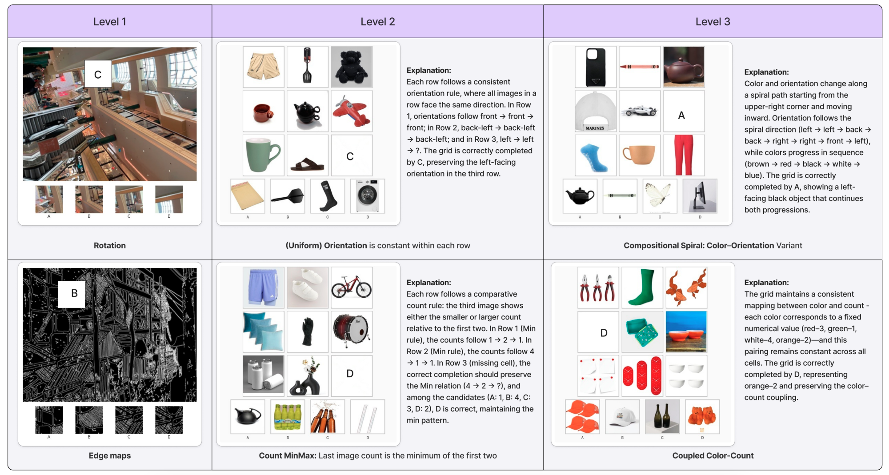

# VisRes Bench

**On Evaluating the Visual Reasoning Capabilities of VLMs**

Brigitta Malagurski Törtei, Yasser Dahou, Ngoc Dung Huynh, Wamiq Reyaz Para, Phúc H. Lê Khac, Ankit Singh, Sofian Chaybouti, Sanath Narayan

[](https://arxiv.org/abs/2512.21194) [PDF](https://arxiv.org/pdf/2512.21194) · [Hugging Face Dataset](https://huggingface.co/datasets/tiiuae/visres_bench)

---

## Benchmark overview

| Level | Name | Description |
|-------|------|-------------|
| 1 | Perceptual completion & matching | Perceptual completion and global image matching under perturbations: blur, texture changes, occlusion, rotation. |
| 2 | Rule-based inference | Rule-based inference over a single attribute (e.g., color, count, orientation). |
| 3 | Compositional reasoning | Compositional reasoning integrating multiple visual attributes. |



*Real samples from each level. Level 1 (top) involves direct visual completion and matching without explicit rule inference (e.g., patch-C correctly continues the ceiling texture compared to patch-D), while Levels 2 and 3 (bottom) require increasingly complex rule-based reasoning over perceptual attributes. Accurate perception of individual attributes is necessary but not sufficient for solving compositional tasks. Current VLMs show poor performance on these compositional tasks. See Section 4.2.*

---

## Benchmark statistics

| Level | Tasks | Total examples |
|-------|-------|----------------|
| 1 | global_occlusion_50, global_occlusion_70, global_occlusion_80, edges, location_random_sampling, brightness, blur, rotation, rotation_random_sampling, edges_random_sampling, location | 11,000 |
| 2 | uniform_count, count_progression, uniform_orientation, count_2_same_1_diff, orientation_2same_1diff, uniform_color, count_arithmetic, count_minmax, orientation_3_diff, color_2same_1diff, color_3_diff, count_3_diff | 5,956 |
| 3 | spiral_color_orientation, coupled_color_count, independent_color_object_orientation, coupled_color_orientation, Independent_count_object_color | 2,522 |
| **Total** | | **19,478** |

<details>
<summary>Per-task breakdown</summary>

| Config / task | Level | Examples |
|---------------|-------|----------|
| level_1_global_occlusion_50 | 1 | 1,000 |
| level_1_global_occlusion_70 | 1 | 1,000 |
| level_1_global_occlusion_80 | 1 | 1,000 |
| level_1_edges | 1 | 1,000 |
| level_1_location_random_sampling | 1 | 1,000 |
| level_1_brightness | 1 | 1,000 |
| level_1_blur | 1 | 1,000 |
| level_1_rotation | 1 | 1,000 |
| level_1_rotation_random_sampling | 1 | 1,000 |
| level_1_edges_random_sampling | 1 | 1,000 |
| level_1_location | 1 | 1,000 |
| level_2_uniform_count | 2 | 500 |
| level_2_count_progression | 2 | 500 |
| level_2_uniform_orientation | 2 | 458 |
| level_2_count_2_same_1_diff | 2 | 500 |
| level_2_orientation_2same_1diff | 2 | 498 |
| level_2_uniform_color | 2 | 500 |
| level_2_count_arithmetic | 2 | 500 |
| level_2_count_minmax | 2 | 500 |
| level_2_orientation_3_diff | 2 | 500 |
| level_2_color_2same_1diff | 2 | 500 |
| level_2_color_3_diff | 2 | 500 |
| level_2_count_3_diff | 2 | 500 |
| level_3_spiral_color_orientation | 3 | 350 |
| level_3_spiral_color_orientation | 3 | 464 |
| level_3_coupled_color_count | 3 | 500 |
| level_3_independent_color_object_orientation | 3 | 355 |
| level_3_coupled_color_orientation | 3 | 374 |
| level_3_Independent_count_object_color | 3 | 479 |

</details>

---

## Main results

Accuracy (%) across levels and subtasks. Random chance = 25%. Guided prompting; thinking mode when available. Full tables: [Hugging Face dataset card](https://huggingface.co/datasets/tiiuae/visres_bench).

| Setting | GPT-5 | GPT-4o | Gemini-2.5 | Qwen3-VL-4B | Qwen3-VL-30B | Mimo-VL-7B |
|---------|-------|--------|------------|-------------|--------------|------------|
| **Level-1** | | | | | | |
| Edges | 27.17 | 23.91 | 25.00 | 16.67 | 25.00 | 22.30 |
| Location | 23.71 | 20.62 | 26.00 | 23.16 | 22.40 | 25.77 |
| Rotation | 35.42 | 26.04 | 34.38 | 37.50 | 36.05 | 29.17 |
| Brightness | 25.26 | 27.37 | 27.37 | 31.52 | 29.47 | 27.37 |
| Blur | 31.18 | 25.26 | 26.32 | 24.73 | 24.28 | 26.32 |
| Global@50% | 42.86 | 20.88 | 57.14 | 37.50 | 47.25 | 48.35 |
| Global@80% | 32.61 | 22.83 | 36.96 | 25.88 | 35.87 | 30.43 |
| **Level-1 Average** | **31.10** | **23.86** | **33.28** | **28.17** | **31.20** | **29.22** |
| **Level-2** | | | | | | |
| Uniform Color | 96.00 | 21.00 | 97.00 | 66.20 | 88.00 | 78.95 |
| Uniform Count | 61.00 | 25.00 | 90.91 | 40.82 | 59.00 | 52.75 |
| Uniform Orientation | 22.22 | 25.25 | 26.53 | 26.00 | 23.00 | 19.19 |
| Count Progression | 50.00 | 13.00 | 77.00 | 37.20 | 48.00 | 36.96 |
| Count Arithmetic | 52.00 | 22.00 | 75.76 | 43.20 | 49.00 | 33.33 |
| **Level-2 Average** | **49.79** | **24.12** | **62.29** | **37.18** | **46.75** | **39.15** |
| **Level-3** | | | | | | |
| Independent Color-Object-Orientation | 34.00 | 25.25 | 38.00 | 27.39 | 32.60 | 19.00 |
| Independent Count-Object-Color | 34.00 | 24.00 | 44.00 | 29.45 | 36.34 | 29.00 |
| Coupled Color-Orientation | 24.24 | 24.00 | 16.33 | 26.13 | 29.43 | 20.00 |
| Coupled Color-Count | 30.00 | 22.00 | 21.21 | 27.46 | 33.33 | 28.00 |
| Spiral Color-Count-Object | 56.00 | 30.00 | 54.17 | 28.63 | 36.00 | 33.00 |
| **Level-3 Average** | **34.39** | **23.86** | **33.73** | **26.31** | **31.36** | **25.17** |

Additional results (finetuning, single-attribute recognition, thinking mode, resolution) are on the [dataset card](https://huggingface.co/datasets/tiiuae/visres_bench).

---

## How to evaluate your models

VisRes Bench is integrated into [lmms-eval](https://github.com/EvolvingLMMs-Lab/lmms-eval), the unified evaluation toolkit for multimodal models.

**Install and run:**

```bash
git clone https://github.com/EvolvingLMMs-Lab/lmms-eval.git
cd lmms-eval && uv pip install -e ".[all]"

# Run evaluation (example: Qwen2.5-VL on VisRes Bench)
python -m lmms_eval \
  --model qwen2_5_vl \
  --model_args pretrained=Qwen/Qwen2.5-VL-3B-Instruct \
  --tasks visres_bench \
  --batch_size 1
```

See the [lmms-eval repository](https://github.com/EvolvingLMMs-Lab/lmms-eval/tree/main/lmms_eval/tasks/visres_bench) for supported models, task variants (e.g. by level or config), and full documentation.

---

## Citation

```bibtex
@article{visres2025,
  title={VisRes Bench: On Evaluating the Visual Reasoning Capabilities of VLMs},
  author={Malagurski T{\"o}rtei, Brigitta and Dahou, Yasser and Huynh, Ngoc Dung and Para, Wamiq Reyaz and L{\^e} Khac, Ph{\'u}c H. and Singh, Ankit and Chaybouti, Sofian and Narayan, Sanath},
  journal={arXiv preprint arXiv:2512.21194},
  year={2025}
}
```

---

[arXiv:2512.21194](https://arxiv.org/abs/2512.21194) (cs.CV) · [Dataset on Hugging Face](https://huggingface.co/datasets/tiiuae/visres_bench)
